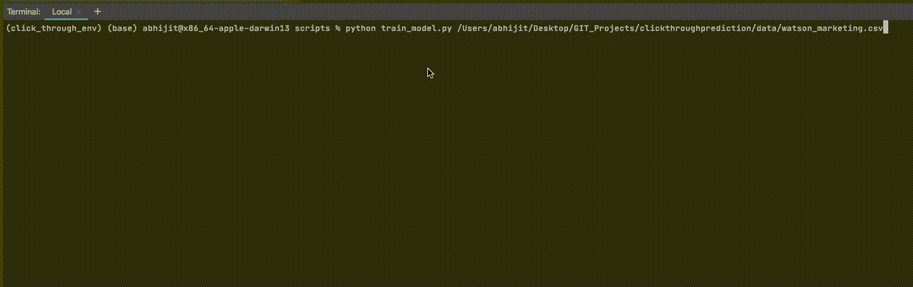

# Click Through Probability for Marketing Analysis 

## Goal 

To predict the probability with which a given customer will respond to an advertisement. 

## Requirements 

1. Multivariate regression, preferability ad-related like predicting a click probability

2. Visualize the dataset and describe it - [Visualization Notebook](src/notebooks/data_viz.ipynb)

3. Deal with data issues like outliers, missing data, under-sampled data. - [Data Engineering Notebook](src/notebooks/data_engineering.ipynb)

4. Feature selection - [Feature Engineering Notebook](src/notebooks/feature_engineering_selection.ipynb)

5. Feature engineering - [Feature Engineering Notebook](src/notebooks/feature_engineering_selection.ipynb)

6. Properly validate.( train/test/validation or k-folds/validation) - [Modelling Notebook](src/notebooks/modelling.ipynb)

7. Why did you choose the model(s) - [Modelling Notebook](src/notebooks/modelling.ipynb)

8. Create ensemble/stack. Why/why not? - XGBoost performs quite well making it unnecessary for me to create an ensemble stack. 

9. How well did your best models work? Why did you use the evaluation metrics that you did? - [Modelling Notebook](src/notebooks/modelling.ipynb)

10. Confidence/credibility interval. - [Modelling Notebook](src/notebooks/modelling.ipynb)

11. Model interpretability. Why? - [Modelling Notebook](src/notebooks/modelling.ipynb)

12. Coding style guide/comments? - [PEP8](https://www.python.org/dev/peps/pep-0008/)

13. How might you look for bias in the data/model? - **The model still may be slightly biased towards predicting a lower probability for click through rates.**

14. Did the constraint of predicting probability affect the best model? - **Yes. It is difficult to verify accuracy of probability primarily because what we have as results are a binary classification.**

15. Next steps. Given more time does anything more need to be done? If so, what? - **Build a better oversampling technique to reduce bias towards oversampled class.**

## Usage 

```console
python -m venv <name_of_virtualenv>
source /<name_of_virtualenv>/bin/activate
pip install -r requirements.txt
```

### To train model on new data. 
```console
cd src/scripts
python train_model.py <filename>
```


### To predict on new data after training. 
```console
cd src/scripts
python {prog_name} <filename> <model_filename>
```

The resulting log with the proabilities will get saved in the logs folder under /src/scripts. 


